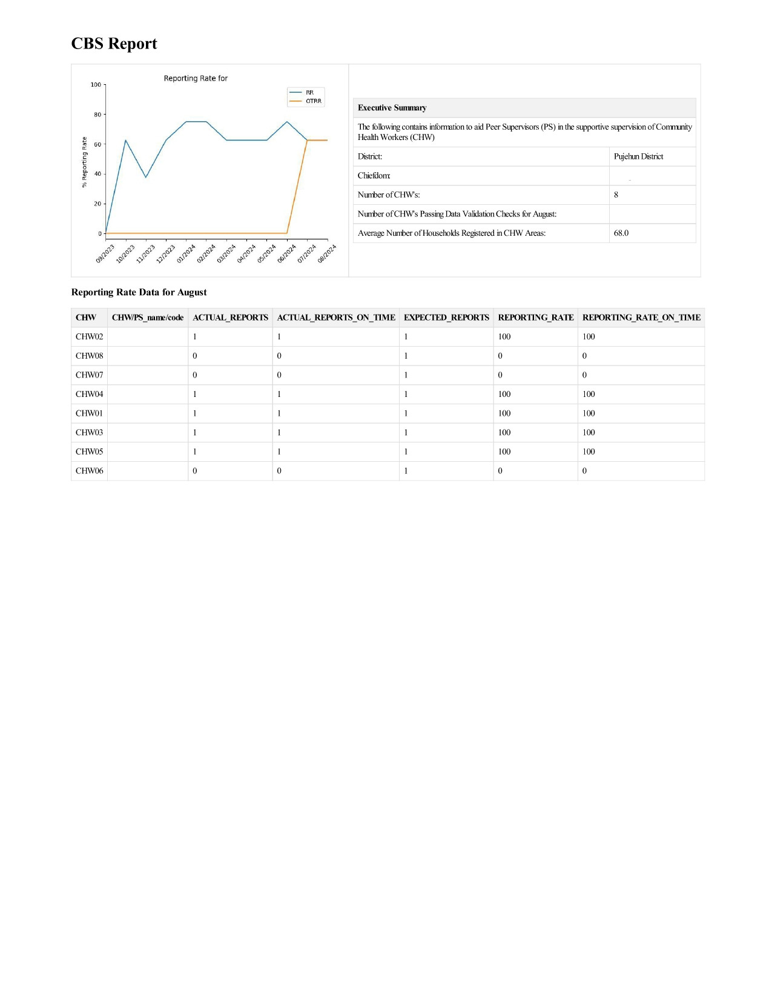
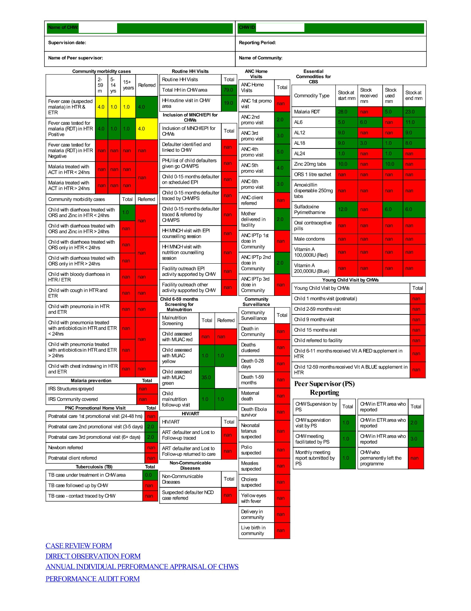

# Community Based Surveillance Supportive Supervision Report

## Introduction

Sierra Leone has had Community Health Workers (CHWs) in various forms since 2012.[^1] These programs are designed to expand access to health care and reduce maternal, newborn, and child morbidity and mortality. Similar programs have proved effective in achieving these aims in other low- and middle-income countries.[^2][^3][^4]

Peer Supervisors (PS) were formally introduced in 2016 with the goal of improving data collection and reporting.[^1] Their role also focuses on coaching, mentorship, and on-the-job training of the CHWs within their catchment area.[^1]

The aim of this project is to offer resources in the form of data quality analysis at the CHW level to aid in the supportive supervision of CHWs by the PSs. This approach has been demonstrated to positively affect CHW effectiveness in certain contexts.[^5]

## Methods

Data is first scraped from DHIS2 using the dhis2.py package.[^6] CHW-level data from the monthly summary HF04 is collected for the last 12 months, along with organizational hierarchy and HF04 reporting rate indicators.

### Figure 1: Project Flowchart

Reports are then compiled locally in Python visualized in figure 1. A front page displaying clinic summaries of HF04 data and CHW performance is generated based on the CHC name (Fig 2.). Each CHW then has a page displaying the results of data validation tests run on their monthly HF04 data (Fig 3.).

### Figure 2: CHC Summary Page

### Figure 3: CHW Summary Page

After reports are generated as PDFs, they are delivered to PSs via WhatsApp messaging service. PDF forms contain hyperlinks to submit CHW feedback directly to DHIS2.

## Project Roadmap

### v0.3 (Complete)
- Generate report with monthly indicators
- Create clinic summary front page

### v0.4 (In Progress)
- Run validation checks and display results on CHW monthly summary
- Complete README

### v0.5 (Planned)
- Create basic WhatsApp delivery system
- Add data download and update script
- Add tests for validation checks and data download

## References

[^1]: Williams, P. Sierra Leone's Community Health Workers. CHW Central. https://chwcentral.org/sierra-leones-community-health-workers/ (accessed 2024-09-30).

[^2]: Lassi, Z. S.; Bhutta, Z. A. Community‐based Intervention Packages for Reducing Maternal and Neonatal Morbidity and Mortality and Improving Neonatal Outcomes. Cochrane Database of Systematic Reviews 2015, 2015 (3). https://doi.org/10.1002/14651858.cd007754.pub3.

[^3] Lewin, S.; Munabi‐Babigumira, S.; Glenton, C.; Daniels, K.; Bosch‐Capblanch, X.; Wyk, B. E. van; Odgaard‐Jensen, J.; Johansen, M.; Aja, G. N.; Zwarenstein, M.; Scheel, I. B. Lay Health Workers in Primary and Community Health Care for Maternal and Child Health and the Management of Infectious Diseases. Cochrane Database of Systematic Reviews 2010, No. 3. https://doi.org/10.1002/14651858.cd004015.pub3.

[^4] Okwundu, C. I.; Nagpal, S.; Musekiwa, A.; Sinclair, D. Home‐ or Community‐based Programmes for Treating Malaria. Cochrane Database of Systematic Reviews 2013, No. 5. https://doi.org/10.1002/14651858.cd009527.pub2.

[^5] Whidden, C.; Kayentao, K.; Liu, J. X.; Lee, S.; Keita, Y.; Diakité, D.; Keita, A.; Diarra, S.; Edwards, J.; Yembrick, A.; Holeman, I.; Samaké, S.; Plea, B.; Coumaré, M.; Johnson, A. D. Improving Community Health Worker Performance by Using a Personalised Feedback Dashboard for Supervision: A Randomised Controlled Trial. J Glob Health 8 (2), 020418. https://doi.org/10.7189/jogh.08.020418.

[^6]: Dhis2.Py: Python Wrapper for DHIS2. https://github.com/davidhuser/dhis2.py (accessed 2024-09-30).

